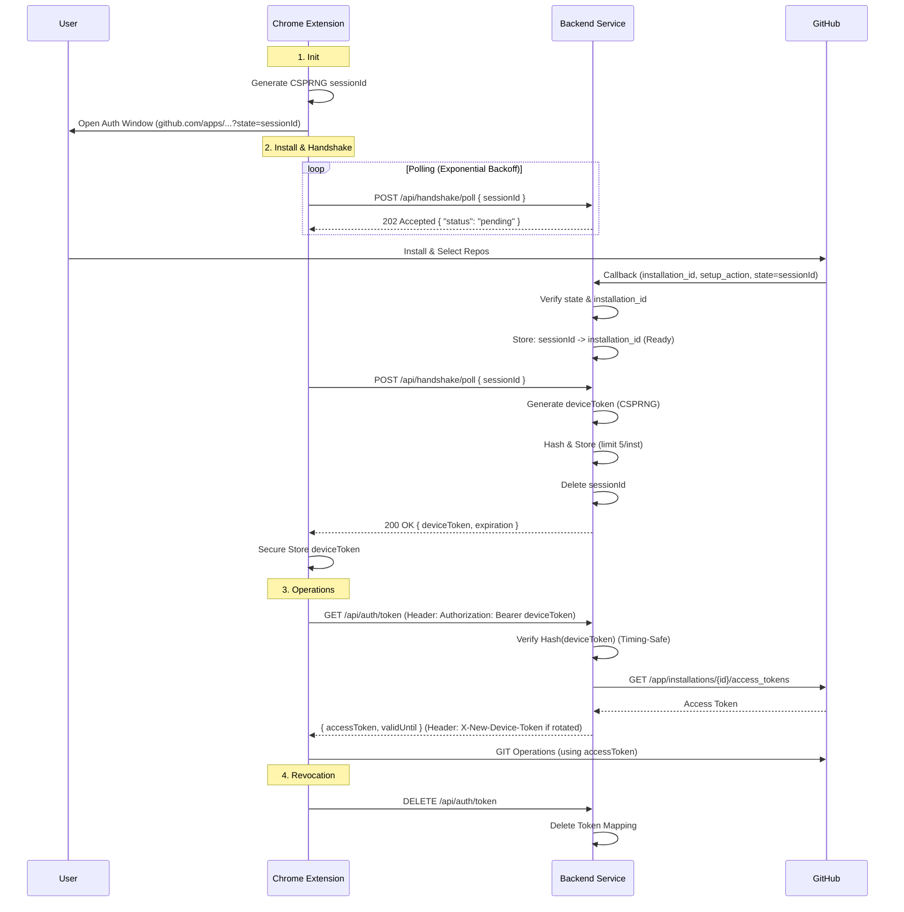

# AnalyGits - Architecture Summary

## Overview

**AnalyGits** is a Chrome extension that provides **version control for SAP Analytics Cloud (SAC)**. It bridges the gap between SAC's proprietary story/report editing environment and GitHub, enabling developers to:

1. **Extract** script definitions and story metadata from SAC
2. **Visualize** changes with a diff viewer
3. **Push** changes to GitHub repositories
4. **Revert** SAC stories to previous versions stored in GitHub

---

## Technical Stack & Implementation Details

### Programming Languages

| Component | Language | Notes |
|-----------|----------|-------|
| Extension Popup | **TypeScript** + **TSX** | Strict mode enabled, ES2022 target |
| Background Worker | **TypeScript** | Compiled to ES module for Chrome MV3 |
| Styling | **CSS Modules** | Component-scoped CSS files (e.g., `Button.css`) |
| Build Config | **TypeScript** | Vite configuration in `vite.config.ts` |

### Frameworks & Libraries

| Dependency | Version | Purpose |
|------------|---------|---------|
| **React** | 19.2.0 | UI framework |
| **Vite** | 7.2.4 | Build tool and dev server |
| **TypeScript** | 5.9.3 | Type safety |
| **i18next** | 25.7.3 | Internationalization (English + other locales) |
| **TipTap** | 3.13.0 | Rich text editor for commit messages |
| **Floating UI** | 1.7.4 | Tooltip/popover positioning |
| **Vitest** | 4.0.15 | Unit testing |
| **ESLint** | 9.39.1 | Code linting |

### Chrome Extension APIs Used

| API | Usage |
|-----|-------|
| `chrome.storage.local` | Persist auth tokens, user preferences, last story state |
| `chrome.runtime.sendMessage` | Communication between popup and background worker |
| `chrome.tabs.query` | Auto-detect SAC story from active tab URL |
| `chrome.action` | Control extension icon badges |
| `chrome.alarms` | (Permission declared, reserved for future background polling) |

### Build Configuration

```typescript
// Vite multi-entry build for Chrome extension
rollupOptions: {
  input: {
    popup: resolve(__dirname, 'src/popup/index.html'),
    background: resolve(__dirname, 'src/background/background.ts'),
  },
  output: {
    entryFileNames: '[name].js',  // popup.js, background.js
  }
}
```

**TypeScript Settings:**
- `strict: true` - Full strict mode
- `noUnusedLocals: true` / `noUnusedParameters: true` - Clean code enforcement
- `verbatimModuleSyntax: true` - Explicit type-only imports
- `jsx: react-jsx` - Modern JSX transform (no React import needed)

---

## Known Quirks & Edge Cases

### SAC API Quirks

#### 1. **Nested & Inconsistent JSON Structures**

SAC's API returns story content with varying structures across different story types:

```typescript
// Content might be at different locations:
resource.cdata.content          // Standard stories
resource.cdata.contentOptimized // "Unified" stories  
resource.cdata                  // Sometimes cdata IS the content
```

The `extractStoryContent()` function handles this with multiple fallback checks.

#### 2. **Stringified JSON Inside JSON**

SAC often returns `resource.cdata.content` as a **JSON string** (not an object), requiring double-parsing:

```typescript
// First parse: API response → JSON object
const data = JSON.parse(responseText);
// Second parse: cdata.content string → actual content object  
const content = JSON.parse(resource.cdata.content);
```

#### 3. **Complex Entity IDs (JSON Keys)**

Widget and script object IDs in SAC are often JSON strings themselves:

```javascript
// Actual key in the events map:
'[{"appPage":"ABC123"},{"widget":"Button_1"}]'

// Must parse to extract meaningful ID:
const parsed = JSON.parse(key);
const widgetId = parsed[parsed.length - 1].widget; // "Button_1"
```

The `sacParser.ts` has extensive logic to resolve human-readable names from these complex keys using the `names` map.

#### 4. **CSRF Token Requirements**

SAC requires CSRF tokens for POST requests. The token must be fetched separately:

```typescript
// Step 1: GET request with special header to receive token
const resp = await fetch(url, {
  method: "GET",
  headers: { "X-CSRF-Token": "Fetch" }
});
const token = resp.headers.get("x-csrf-token");

// Step 2: Use token in actual POST
const result = await fetch(url, {
  method: "POST", 
  headers: { "X-CSRF-Token": token }
});
```

#### 5. **Session Detection via HTML Response**

When SAC sessions expire, the API returns HTML login pages instead of JSON errors:

```typescript
// Detection in sacParser.ts
if (trimmed.startsWith("<html") || 
    trimmed.includes("session terminated") ||
    trimmed.includes("sitzung beendet")) {  // German
  throw new Error("SAC_SESSION_TIMEOUT");
}
```

#### 6. **Script Objects Location**

Script objects can be found in multiple locations depending on story type:

```typescript
// Location 1: On the app entity wrapper
appEntity.scriptObjects

// Location 2: Nested in the app model
appEntity.app.scriptObjects

// Location 3: In entities array directly
entities.find(e => e.type === "scriptObject")
```

#### 7. **Update Counter for Optimistic Locking**

SAC uses `updateCounter` (version number) for optimistic concurrency control:

```typescript
// Must include correct version to avoid "story modified externally" errors
payload.data.updateOpt.localVer = resource.updateCounter ?? 1;
```

---

### GitHub API Quirks

#### 1. **Installation Token Limitations**

GitHub App installation tokens (`ghs_...`) cannot access `/user` endpoint:

```typescript
// Optimization: Skip the request entirely for installation tokens
if (accessToken.startsWith('ghs_')) {
  // Use fallback: fetch public profile of repo owner instead
  const publicResp = await fetch(`/users/${fallbackLogin}`);
}
```

#### 2. **Deletion in Git Trees**

To delete a file via Git Database API, set `sha: null` (not undefined):

```typescript
treeItems.push({
  path: diff.path,
  mode: '100644',
  type: 'blob',
  sha: null,  // Critical: null signals deletion
});
```

#### 3. **Empty Repository Handling**

New/empty repositories return 404 or 409 when fetching tree:

```typescript
if (response.status === 404 || response.status === 409) {
  return [];  // Treat as empty tree, not error
}
```

---

### Content Normalization

To ensure consistent diffs across platforms, all content is normalized:

```typescript
// normalize.ts rules:
// 1. CRLF → LF (Windows compatibility)
// 2. Trim trailing whitespace per line
// 3. Ensure exactly one newline at EOF
// 4. Empty content becomes single newline
```

This prevents false-positive diffs from whitespace differences.

---

### Popup Rendering Quirks

#### 1. **Flash Prevention**

The popup initially returns `null` until storage and i18n are loaded:

```tsx
// Prevent brief "small popup" flash during async loading
if (!isStorageLoaded || !isLanguageLoaded) {
  return null;
}
```

#### 2. **Fixed Width Constraint**

Chrome extension popups have a `max-height: 600px` limit. The UI uses:

```css
body { width: 420px; }
.app-container { max-height: 600px; }
.app-main { overflow-y: auto; }  /* Scroll within limit */
```

#### 3. **Modal Height Reservation**

When settings modal opens, minimum height is reserved to prevent layout jumps:

```css
.app-container.modal-open { min-height: 450px; }
```

---

### Background Worker Quirks

#### 1. **Service Worker Lifecycle**

Chrome MV3 service workers can terminate at any time. Polling state is persisted:

```typescript
// Store progress in chrome.storage.local
await updateState({ pollAttempt: attempt });

// Resume on worker restart
chrome.runtime.onStartup.addListener(resumeIfNeeded);
chrome.runtime.onInstalled.addListener(resumeIfNeeded);
```

#### 2. **Suppressing "Receiving End" Errors**

When popup is closed during background message send:

```typescript
chrome.runtime.sendMessage({ ... }, () => {
  void chrome.runtime.lastError;  // Suppress uncaught error
});
```

---

### Commit Message Editor

Uses TipTap for rich text editing with:
- Placeholder text support
- Single-line mode (Document, Paragraph, Text extensions only)
- Custom suggestion system for conventional commit types

---

### Testing

```bash
npm test          # Run Vitest
npm run lint      # ESLint check
npm run build     # TypeScript compile + Vite build
```

Test files located in `/tests/`:
- `sacParser.test.ts` - Story parsing logic
- `diff.test.ts` - Diff algorithm
- `normalize.test.ts` - Content normalization
- `commitSerializer.test.ts` - Commit message formatting
- `scopeCalculator.test.ts` - Auto-scope suggestion

---

## High-Level Architecture

```
┌─────────────────────────────────────────────────────────────────────────────┐
│                           Chrome Extension                                   │
│  ┌─────────────────────────────────────────────────────────────────────────┐ │
│  │                         Popup UI (React)                                │ │
│  │  ┌──────────────┐  ┌──────────────┐  ┌──────────────┐  ┌─────────────┐  │ │
│  │  │ StoryViewer  │  │ GitHubPanel  │  │  DiffViewer  │  │ AuthContext │  │ │
│  │  └──────────────┘  └──────────────┘  └──────────────┘  └─────────────┘  │ │
│  └─────────────────────────────────────────────────────────────────────────┘ │
│                                    │                                         │
│                                    ▼                                         │
│  ┌─────────────────────────────────────────────────────────────────────────┐ │
│  │                    Background Service Worker                            │ │
│  │  • CSRF Token Handling   • SAC API Proxying   • GitHub OAuth Flow       │ │
│  └─────────────────────────────────────────────────────────────────────────┘ │
└─────────────────────────────────────────────────────────────────────────────┘
                          │                           │
                          ▼                           ▼
          ┌───────────────────────────┐   ┌───────────────────────────┐
          │    SAP Analytics Cloud    │   │    Fastify Backend        │
          │    (SAC REST API)         │   │    api.analygits.com      │
          │                           │   │                           │
          │  • getContent             │   │  ┌─────────────────────┐  │
          │  • updateContent          │   │  │    Redis Database   │  │
          │                           │   │  │  (Session Store)    │  │
          │                           │   │  └─────────────────────┘  │
          └───────────────────────────┘   │             │             │
                                          │             ▼             │
                                          │  ┌─────────────────────┐  │
                                          │  │    GitHub App       │  │
                                          │  │  (analygitsapp)     │  │
                                          └──┴─────────────────────┴──┘
                                                        │
                                                        ▼
                                          ┌───────────────────────────┐
                                          │      GitHub API           │
                                          │  • Repository Access      │
                                          │  • Git Database API       │
                                          │  • Commits, Trees, Blobs  │
                                          └───────────────────────────┘
```

---

## Core Components

### 1. Popup UI (`src/popup/`)

The user-facing interface built with **React** and **TypeScript**.

#### Key Components:

| Component | Purpose |
|-----------|---------|
| `App.tsx` | Main application container, auto-detects SAC stories from the current tab URL |
| `StoryViewer.tsx` | Displays parsed story content (pages, global variables, script objects, events) |
| `GitHubPanel.tsx` | GitHub integration UI - repo selection, diff viewing, commit creation, revert functionality |
| `DiffViewer.tsx` | Side-by-side comparison of local SAC content vs. GitHub repository |
| `RepoPicker.tsx` | Repository and branch selection dropdown |
| `AuthContext.tsx` | React Context for managing authentication state across the app |

#### Services:

- **`services/github/`** - GitHub API interactions split into modules:
    - `auth.ts`: Authentication flows
    - `git.ts`: Tree/blob/commit operations
    - `utils.ts`: Shared utilities
- **`sacParser.ts`** - Parses SAC story JSON into structured TypeScript objects

---

### 2. Background Service Worker (`src/background/background.ts`)

Chrome's background script handles:

1. **SAC API Proxying** - Makes authenticated requests to SAC using session cookies
2. **CSRF Token Management** - Automatically fetches and injects CSRF tokens for POST requests
3. **GitHub OAuth Flow** - Manages the multi-step authentication handshake
4. **Visual State** - Controls extension icon badges

**Key Message Types:**
- `FETCH_DATA` - Proxy GET/POST requests to SAC
- `GITHUB_CONNECT_START` - Initiate GitHub App installation flow

---

### 3. SAC Integration (`src/sac/`)

#### `sacApi.ts` - SAC REST API Client

| Function | Description |
|----------|-------------|
| `getContent(storyId)` | Fetches full story content including scripts, widgets, and metadata |
| `updateContent(params)` | Saves modified story content back to SAC |
| `extractStoryContent(cdata)` | Extracts the actual content object from SAC's wrapper structure |
| `testNoOpSave(storyId)` | Debug function to test save capability without changes |

#### `revertPatch.ts` - Revert Functionality

| Function | Description |
|----------|-------------|
| `parseGitHubScriptPath(path)` | Interprets a GitHub file path to determine what SAC entity it represents |
| `patchStoryContentWithGitHubFile(params)` | Applies a GitHub file's content to the corresponding SAC script |
| `removeContentFromStory(params)` | Clears content when reverting "added" items (exist in SAC but not GitHub) |

---

### 4. Diff Engine (`src/diff/`)

Compares SAC content with GitHub repository state:

| Module | Purpose |
|--------|---------|
| `adapter.ts` | Builds a virtual file tree from parsed SAC content |
| `materialize.ts` | Extracts scripts from raw SAC JSON into file-like structure |
| `normalize.ts` | Normalizes content for consistent comparison (line endings, whitespace) |
| `diff.ts` | Core diffing logic to identify added/modified/deleted files |
| `types.ts` | TypeScript definitions for `VirtualTree` and `FileDiff` |

**Virtual Tree Structure:**
```
stories/
  └── <StoryName>/
      ├── README.md           # Story metadata
      ├── globalVars.js       # Global variable declarations
      └── scripts/
          ├── global/         # Script Objects (reusable functions)
          │   └── <ObjectName>/
          │       └── <FunctionName>.js
          └── widgets/        # Widget event handlers
              └── <WidgetName>/
                  └── <EventName>.js
```

---

## Backend Communication (Fastify + Redis + GitHub App)

### Authentication Flow (Sequence Diagram)



### API Endpoints

| Endpoint | Method | Purpose |
|----------|--------|---------|
| `/api/handshake/poll` | POST | Poll for OAuth completion with sessionId |
| `/api/auth/token` | POST | Exchange deviceToken for GitHub access token |
| `/api/auth/token` | DELETE | Revoke device token (logout) |

### Redis Data Model

```
Session: {
  sessionId: string,        // CSPRNG-generated, 64 hex chars
  status: 'pending' | 'ready',
  deviceToken?: string,     // After successful auth
  installationId?: number,  // GitHub App installation ID
  expiration?: string       // ISO 8601 timestamp
}
```

---

## Key Workflows

### 1. Fetching a Story

1. User opens extension while on SAC story page
2. Extension auto-detects `storyId` from URL hash (`/#/s2/<STORY_ID>`)
3. Constructs API URL using tenant info
4. Background worker makes POST to SAC's `contentlib` endpoint
5. Response parsed by `sacParser.ts` into `ParsedStoryContent`
6. UI displays story structure in `StoryViewer`

### 2. Comparing with GitHub (Fetch & Diff)

1. `GitHubPanel` gets installation access token via backend
2. Fetches repository's file tree from GitHub API
3. Builds local virtual tree from current SAC content
4. Compares trees to identify:
   - **Added** files (in SAC, not in GitHub)
   - **Modified** files (different content)
   - **Deleted** files (in GitHub, not in SAC)
5. Displays diff in `DiffViewer` component

### 3. Pushing Changes (Commit)

1. User selects files to include in commit
2. User writes commit message (with auto-suggested scope)
3. Extension creates:
   - Git blobs for new/modified files
   - New tree referencing changes
   - Commit object with author info
   - Updates branch reference
4. Returns commit URL for confirmation

### 4. Reverting from GitHub

1. User clicks "Revert" on a diff item
2. Extension fetches file content from GitHub
3. `parseGitHubScriptPath` identifies target (widget event or script object function)
4. `patchStoryContentWithGitHubFile` applies the change in-memory
5. `updateContent` sends modified story back to SAC

---

## Security Considerations

### Device Token Model

- **Long-lived device tokens** stored in `chrome.storage.local`
- Exchanged for **short-lived access tokens** per session
- Backend handles GitHub App JWT signing (private key never exposed)
- Tokens can be explicitly revoked on logout

### SAC Authentication

- Extension relies on **existing SAC session cookies**
- Background worker includes `credentials: "include"` for all SAC requests
- CSRF tokens fetched and injected automatically for POST requests

### Content Security

- Extension pages use strict CSP: `script-src 'self'; object-src 'self'`
- No remote script execution
- All GitHub API calls made directly (no backend proxy for data)

---

## Configuration

```typescript
// src/popup/config.ts
export const config = {
    GITHUB_APP_SLUG: 'analygitsapp',
    BACKEND_BASE_URL: 'https://api.analygits.com',
    DEFAULT_BRANCH: 'main',
    HANDSHAKE_POLL_INTERVAL_MS: 2000,
    HANDSHAKE_POLL_MAX_ATTEMPTS: 150, // 5 minutes timeout
};
```

---

## File Structure

```
sap-documentation-tool/
├── public/
│   └── manifest.json         # Chrome extension manifest (MV3)
├── src/
│   ├── background/
│   │   └── background.ts     # Service worker
│   ├── diff/
│   │   ├── adapter.ts        # Builds virtual tree from parsed content
│   │   ├── diff.ts           # Diffing algorithms
│   │   ├── materialize.ts    # Extracts scripts from raw JSON
│   │   └── normalize.ts      # Content normalization
│   ├── popup/
│   │   ├── App.tsx           # Main popup component
│   │   ├── components/       # UI components & CSS modules
│   │   │   ├── GitHubPanel.tsx
│   │   │   ├── GitHubPanel.css
│   │   │   ├── StoryViewer.tsx
│   │   │   └── ...
│   │   ├── context/          # React contexts (Auth)
│   │   ├── hooks/            # Custom React hooks
│   │   ├── services/         # API services
│   │   │   └── github/       # GitHub API integration modules
│   │   │       ├── auth.ts
│   │   │       ├── git.ts
│   │   │       └── ...
│   │   └── utils/            # Parsers and helpers
│   └── sac/
│       ├── sacApi.ts         # SAC REST API client
│       └── revertPatch.ts    # Revert/patch logic
├── tests/                    # Unit tests
└── dist/                     # Built extension (load this in Chrome)
```

---

## Summary

AnalyGits solves a real pain point for SAC developers by bringing modern version control practices to a platform that doesn't natively support them. The architecture cleanly separates:

- **UI concerns** (React popup)
- **Platform bridging** (background worker for SAC API)
- **Authentication** (Fastify backend with Redis for secure GitHub App auth)
- **Content transformation** (diff engine for meaningful file-based representation)

This enables teams to track changes, collaborate via pull requests, and maintain audit trails for their SAC stories—all while staying within the familiar GitHub workflow.
